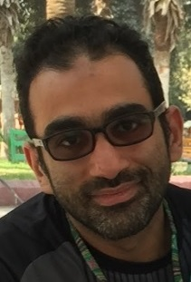
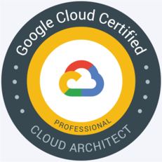
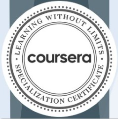

<!DOCTYPE html>
<html lang="en">
    <head>
        <meta charset="utf-8" />
        <link rel="stylesheet" href="CSS/style.css">
        
        <title>Bio | Khaled Rashwan</title>
    </head>
    <body>
        <header>
            <nav>
                <a href="#Experience">Experience</a>
                <a href="#Education">Education</a>
                <a href="#Projects">Projects</a>
                <a href="#continuing-education">Continuing Education</a>
                <a href="#software-skills">Software Skills</a>
            </nav>
            <hgroup>
                <h1>Khaled Rashwan</h1>
                <h2>Professional Cloud Architect</h2>
            </hgroup>
            <figure>
                
                <figcaption></figcaption>
            </figure>
        </header>
        <main>
            <section>
                <h3>About me</h3>
                
I am a Google-certified cloud architect with strong track record in electrical engineering and passion for expanding the world of computing. Interested in software development, Dev-Ops and cloud solutions. Successfully published web projects on google cloud platform.

            </section>
            <section>
                <h3 id="Experience">Experience</h3>
                

                    
Software freelancer: Development, Dev-Ops, Cloud

                    <time datetime="2020-01">Jan 2020</time> - till now
                    <ul>
                        <li>Developing web applications in asp.net core (C#) and flask (Python)</li>
                        <li>Version control on github and managing CI/ CD with google cloud.</li>
                        <li>Publishing on Cloud Run using docker containerization</li>
                    </ul>
                

                

                    
Master's Degree Research Student at Ain Shams University

                    <time datetime="2014-09">Sep 2014</time> - <time datetime="2020-01">Jan 2020</time>:
                    <ul>
                        <li>Simulate and design control systems for Variable Frequency Transformers.</li>
                        <li>Design and simulate wind turbine electrical generation systems</li>
                    </ul>
                

                

                    
Trans Desert Contracting- Senior Instrumentation Engineer

                    <time datetime="2013-01">Jan 2013</time> - <time datetime="2014-04">April 2014</time>:
                    <ul>
                        <li>Installation, Testing & Commissioning of 2 No. DMA (District Metering Area) & 12 No’s bulk meters in Al Ain region</li>
                        <li>Rotork IQM Actuators</li>
                        <li>Nencini LJH Flow Control Valve (400, 600mm DIA)</li>
                        <li>AUMA maulti-turn actuator with controls</li>
                        <li>Endress & Hauser Electro Magnetic Flow Meters & Pressure transmitters</li>
                        <li>BRODERSON RTU using STRATON software "PID Controller"</li>
                    </ul>
                

                

                    
Bin Hamm Group- Instrumentation Engineer

                    <time datetime="2011-01">Jan 2011</time> - <time datetime="2012-12">Dec 2012</time>:
                    <ul>
                        <li>Installation, Testing & Commissioning of 29 No. DMA (District Metering Area) in Al Ain region</li>
                        <li>Rotork IQM Actuators</li>
                        <li>Nencini LJH Flow Control Valve (150mm : 500mm DIA)</li>
                        <li>Endress & Hauser Electro Magnetic Flow Meters & Pressure transmitters</li>
                        <li>BRODERSON RTU using STRATON software "PID Controller"</li>
                        <li>ABB Pressure transmitters, water & soil temperature sensors</li>
                    </ul>
                

                

                    
Egypty Telecom- Telecommunication Engineer

                    <time datetime="2010-01">Jan 2010</time> - <time datetime="2010-12">Dec 2010</time>:
                    <ul>
                        <li>Installing DSLAM cabinets for etisalat Misr - Huawei SmartAXMA5600 DSLAM "Small, Medium, and Large Cabinets" and ensure internet connectivity.</li>
                        <li>Huawei 3900 BTS Cabinet</li>
                        <li>Huawei DRFU & GRFU 900MHz and 1800MHz</li>
                        <li>Microwave links: Huawei RTN 600, RTN 900</li>
                        <li>Different Designs: (1+0, 1+1, 2+0, 2+2, 4+0) Horizontal and Vertical Pol.</li>
                        <li>Huawei T2000 Software</li>
                    </ul>
                

            </section>
            <section>
                <h3 id="Education">Education</h3>
                    <ul>
                        <li>
                            <time datetime="2014-09">Sep 2014</time> - <time datetime="2020-01">Jan 2020</time>: 
                            Master of Engineering in Power Systems, Ain Shams University
                        </li>
                        <li>
                            <time datetime="2003-09">Sep 2003</time> - <time datetime="2009-06">June 2009</time>: 
                            Bachelor of Engineering in Telecommunications and Electronics, Alexandria University
                        </li>
                    </ul>
            </section>
            <section>
                <h3 id="Projects">Projects</h3>
                

                    

                        <a href="https://github.com/DevCodersHub/grad2021git-master.git" target=”_blank”>
                        <abbr title="Management Information System">MIS</abbr> for faculty of engineering, Fayoum University</a>
                    

                    <ul>
                        <li>Created a C# Web Application using ASP.net Core</li>
                        <li>MVC Design Pattern</li>
                        <li>Using ASP.net Individual account authentication system</li>
                        <li>MS SQL Express Edition</li>
                        <li>Containerizing using docker file</li>
                        <li>Version control using github</li>
                        <li>CI/CD with Google Cloud Build</li>
                        <li>Publishing the project with Google Cloud Run</li>
                    </ul>
                

                

                    

                        Film Club Web App. on Google AppEngine
                    

                    <ul>
                        <li>Create a Python web app on Google AppEngine, test it locally and launch it online</li>
                        <li>Authenticate users with Firebase Auth and edit the UI</li>
                        <li>Create and manage entities with Firestore in Datastore mode</li>
                    </ul>
                

            </section>
            <section>
                <h3 id="continuing-education">Continuing Education</h3>
                <figure>
                    
                    <figcaption></figcaption>
                </figure>
                <h4>Professional Certificates (Google Cloud)</h4>
                <ul>
                    <li>Google cloud certified - professional cloud architect</li>
                </ul>
                <figure>
                    
                    <figcaption></figcaption>
                </figure>
                <h4>Specialization Certificates (Coursera)</h4>
                <ul>
                    <li>Preparing for Google Cloud Certification: Cloud Architect</li>
                    <li>Preparing for Google Cloud Certification: Cloud Data Engineer</li>
                    <li>Preparing for Google Cloud Certification: Cloud Engineer</li>
                    <li>Data Engineering, Big Data, and Machine Learning on GCP</li>
                    <li>Architecting with Google Compute Engine</li>
                </ul>
                <h4>Course Certificates (Coursera)</h4>
                <ul>
                    <li>Google cloud certified - professional cloud architect</li>
                    <li>Crash Course on Python (by Google)</li>
                    <li>Introduction to HTML5 (by University of Michigan)</li>
                    <li>Getting Started with Application Development (by Google Cloud)</li>
                    <li>Managing Security in Google Cloud</li>
                    <li>Security Best Practices in Google Cloud</li>
                </ul>
                <h4>Learning Pathes (Microsoft)</h4>
                <ul>
                    <li>Build .NET applications with C#</li>
                </ul>
            </section>
            <section>
                <h3 id="software-skills">Software Skills</h3>
                <h4>Development tools</h4>
                
C#, ASP.NET Core, Python, Flask

                <h4>Dev-Ops</h4>
                
Github, Kubernetes Engine, Docker

                <h4>Cloud</h4>
                
Google Cloud Platform

            </section>
            

                <label for="courseProgress">Progress in this Course (100%)</label>
                    <progress id="courseProgress" value="100" max="100"> 100% </progress> 
                <label for="specProgress">Progress in the Specialization capstone (20%)</label>
                    <progress id="specProgress" value="20" max="100"> 20% </progress> 
                <label for="lifeProgress">Progress in life goals (30%)</label>
                    <progress id="lifeProgress" value="30" max="100"> 30% </progress>
            

        </main>
        <footer>
            <a href="mailto:khaled_abdel_razek@hotmail.com" target=”_blank”>
                <i class="fas fa-at fa-2x"></i>
            </a>
            <a href="https://www.linkedin.com/in/khaled-rashwan" target=”_blank”>
                <i class="fab fa-linkedin fa-2x"></i>
            </a>
            <a href="https://twitter.com/KhaledRashwan2" target=”_blank”>
                <i class="fab fa-twitter-square fa-2x"></i>
            </a>
            <a href="https://github.com/khaled-rashwan" target=”_blank”>
                <i class="fab fa-github-square fa-2x"></i>
            </a>
        </footer>
    </body>
</html>
